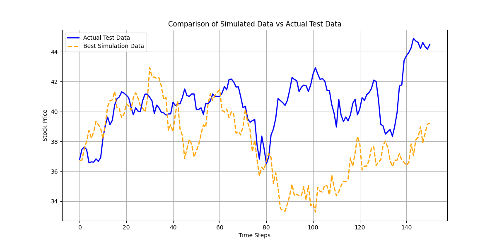
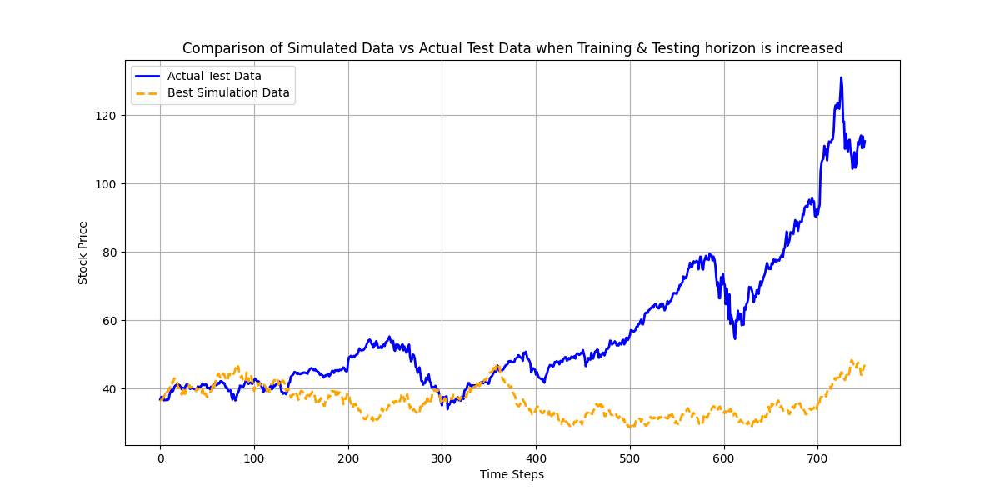
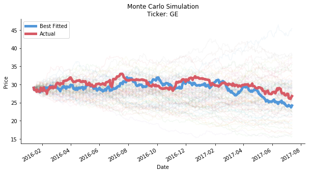
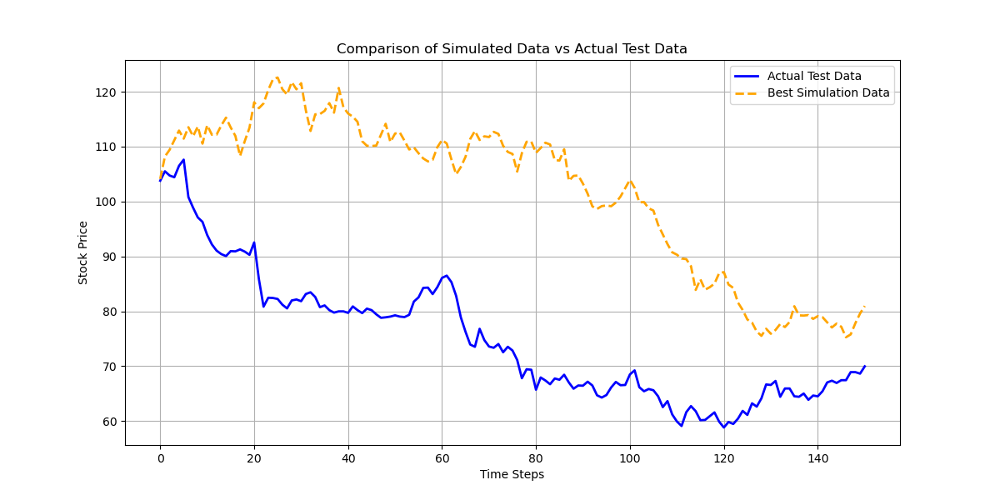
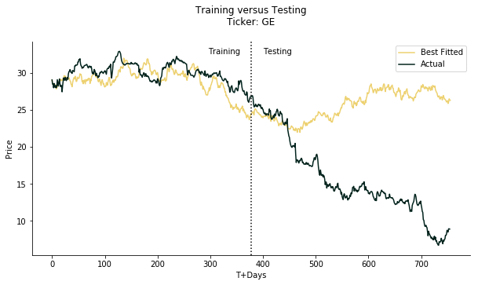
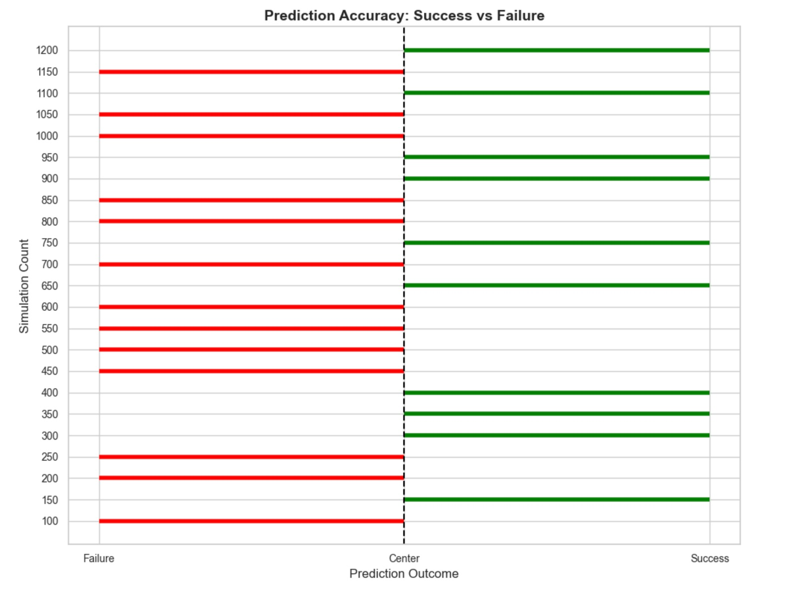

# Monte Carlo Simulation 

Monte Carlo simulation in trading is nothing but house of cards

## Overview
Monte Carlo simulation is a powerful mathematical tool used to model and understand stochastic processes through the simulation of massive amounts of random events. While its capabilities are vast, the application of Monte Carlo methods in financial markets reveals limitations, particularly when predicting extreme events, or "fat tail" occurrences.

This repository dives deep into the nuances of Monte Carlo simulation, showcasing its strengths and limitations in the context of stock price movements. By analyzing real-world cases, such as the dramatic declines of General Electric (GE) and Nvidia (NVDA) stocks during turbulent periods, this repository provides a comprehensive exploration of how Monte Carlo simulations fare in the financial domain.

---

## Motivation
Data science and quantitative finance blogs frequently highlight machine learning methods, such as decision trees or neural networks, for their potential to predict stock prices. However, the harsh reality is that these methods often struggle in live trading environments, with failure rates as high as 90%, as reported by some industry experts.

Monte Carlo simulations offer a different perspective by focusing on the statistical modeling of random events. But how effective are they at predicting extreme market movements? This repository seeks to answer that question through empirical analysis and practical experimentation.

---

## Key Highlights


## 1: Apple (AAPL)
For starters, lets see how our model does on the Apple stock. 
Let's see how our model performs in the testing dataset...



Now, some of us may think that increasing the training and testing horizon would lead to better results, lets see....


    
## 2: General Electric (GE)
To fully explore the potential of Monte Carlo simulation for modeling fat-tail events, we choose General Electric as our ticker. In 2018, GE was one of the worst-performing stocks, with its share price falling by 57.9% due to a prolonged history of unsuccessful mergers and acquisitions.
We split the series into halves, the first half as training horizon and the second half as testing horizon. Monte Carlo simulation will only justify its power if it can predict an extreme event like this. Let's take a look at the figure below. Wow, what a great fit! The best fit is almost like running a cool linear regression with valid input. As you can see, it smoothly fits the curve in **training horizon.**



If we extend it to testing horizon...



A plot showing both training and testing together...



Oops, house of cards collapses. The real momentum is completely the opposite to the forecast, let alone the actual price. The forecast looks quite okay for the first 50 days of testing horizon. After that, the real momentum falls like a stone down through the deep sea while the forecast is gently climbing up. You may argue the number of the iterations is too small so we cannot make a case. Not exactly, let's look at the figure below.



We start from 100 times of simulation to 1200 times of simulation. Each round we increase the number by 50. We don't look at the actual price forecast, just the direction. If the end price of testing horizon is larger than the end price of training horizon, we define it as gain. Vice versa. Only when both actual and forecast directions align, we consider the forecast is accurate. As the result shows, the prediction accuracy is irrelavant to the numbers of simulation. The accuracy is more sort of tossing a coin to guess heads or tails regardless of the times of simulation.
Now that the prophet of Monte Carlo turns out to be a con artist. 

---


## Getting Started

### Prerequisites
Ensure you have Python 3.7 or later installed along with `pip` for managing dependencies.

### Installation Steps
1. Clone this repository:
   ```bash
   git clone https://github.com/yourusername/monte-carlo-simulation.git
   ```
2. Navigate to the repository directory:
   ```bash
   cd monte-carlo-simulation
   ```
3. Install required dependencies:
   ```bash
   pip install -r requirements.txt
   ```
4. Run the simulation scripts:
   ```bash
   python monte_carlo_simulation.py
   ```

---

## Acknowledgments
I took a lot of help and inspiration from https://github.com/je-suis-tm/quant-trading.git

