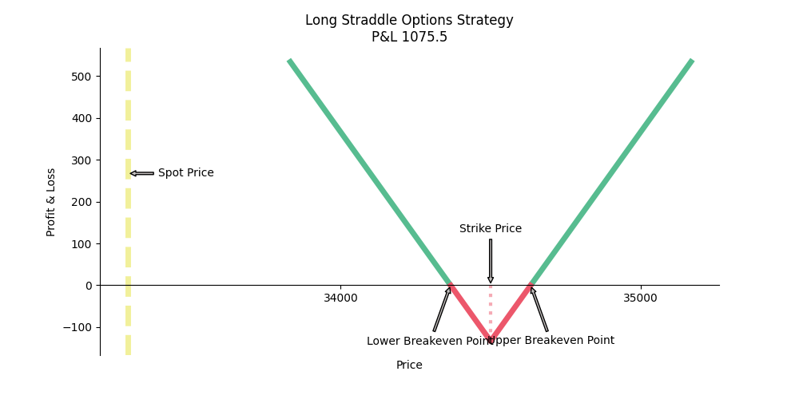
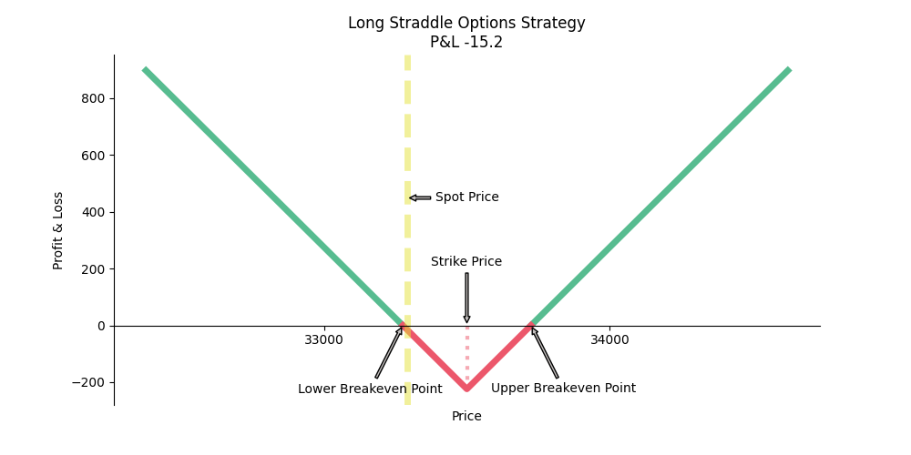
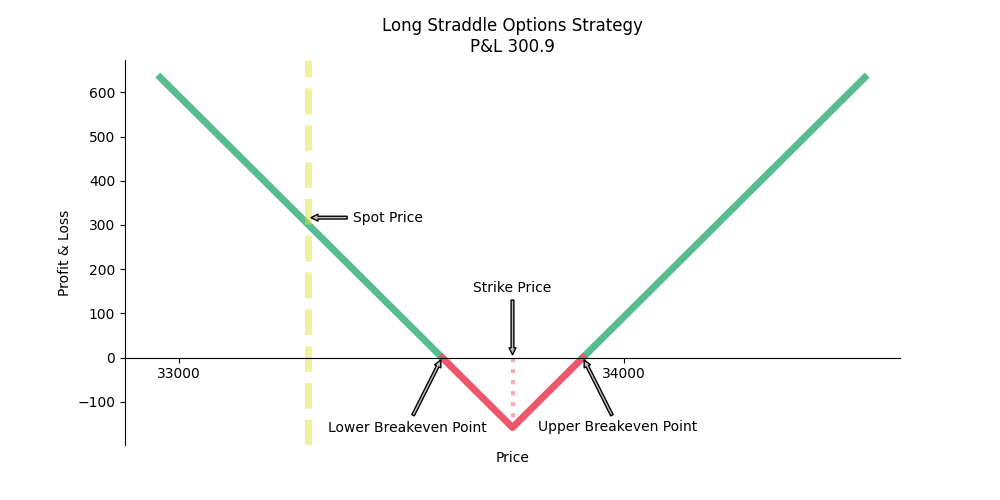

# Options Trading Strategy: Long Straddle

🎯🎯🎯 This repository demonstrates the implementation of the **Long Straddle Options Strategy** using Python. The strategy aims to profit from significant volatility in the market, regardless of the direction.

## Table of Contents
- [Introduction](#introduction)
- [Dataset](#dataset)
- [How It Works](#how-it-works)
- [Results](#results)
- [Usage](#usage)
- [References](#references)

## Introduction
📊📊📊 Options are financial derivatives that give traders the right to buy or sell an underlying asset at a specific price in the future. The **Long Straddle Strategy** involves simultaneously buying a call option and a put option with the same strike price and expiration date. This strategy benefits from high market volatility, as profits are generated when the asset’s price moves significantly in either direction.

### Key Features of Long Straddle:
1. **Unlimited Profit Potential**: The strategy profits from large movements in either direction.
2. **Limited Loss**: The maximum loss is limited to the total premium paid for the call and put options.
3. **Commonly Used In**: Event-driven strategies (e.g., central bank announcements, geopolitical events).

## Dataset
🗂️🗂️🗂️ The repository includes a small dataset of the STOXX 50 index:
- **Spot spreadsheet**: Spot prices for the STOXX 50 index.
- **Aug spreadsheet**: Options data for contracts expiring in August 2019.
- **Jul spreadsheet**: Options data for contracts expiring in July 2019.

The dataset is available at: [STOXX 50 Data](https://github.com/je-suis-tm/quant-trading/tree/master/data).

## How It Works
🔍🔍🔍 The Python script performs the following steps:

1. **Extracting Valid Strike Prices**:
   - Filters strike prices where both call and put options are available.
2. **Data Preparation**:
   - Merges spot price data with call and put option prices for selected strike prices.
3. **Signal Generation**:
   - Identifies pairs of call and put options with minimal price differences (based on a threshold).
4. **Payoff Visualization**:
   - Plots the profit-and-loss diagram for the strategy, showing break-even points and potential profits.

## Results
🖼️🖼️🖼️ Below are the payoff diagrams generated for various strike prices:

### Result 1


### Result 2


### Result 3


Each diagram shows:
- **Strike Price**: The price at which both options are bought.
- **Spot Price**: The current price of the underlying asset.
- **Profit/Loss Zones**:
  - Green: Profit.
  - Red: Loss.

## Usage

💻💻💻 1. Clone the repository:
   ```bash
   git clone <repository-url>
   ```
2. Install the required libraries:
   ```bash
   pip install pandas matplotlib numpy
   ```
3. Place the dataset in the working directory.
4. Run the script:
   ```bash
   python long_straddle.py
   ```
5. Review the generated payoff diagrams to analyze potential profits and losses.

### Prerequisites
- Python 3.x
- Libraries: `pandas`, `numpy`, `matplotlib`

## References
📚📚📚
- [Options Straddle Guide by Fidelity](https://www.fidelity.com/learning-center/investment-products/options/options-strategy-guide/long-straddle)
- [Historical Option Data](https://www.historicaloptiondata.com/)
- [Options Data Mine](http://base2.optionsdatamine.com/page.php)

---
🎓🎓🎓 This repository provides a practical implementation of the Long Straddle Options Strategy. It’s intended for educational purposes only and not as financial advice. Always conduct your own research before trading options.

