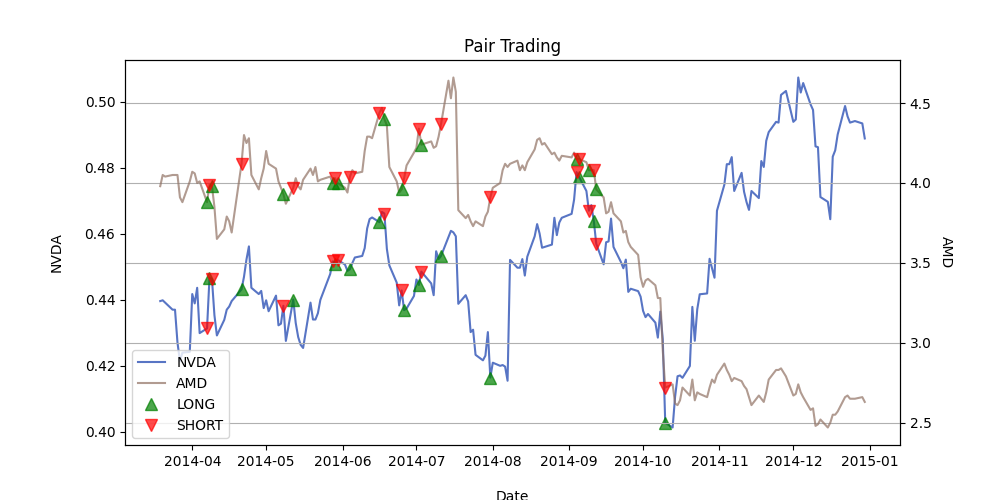
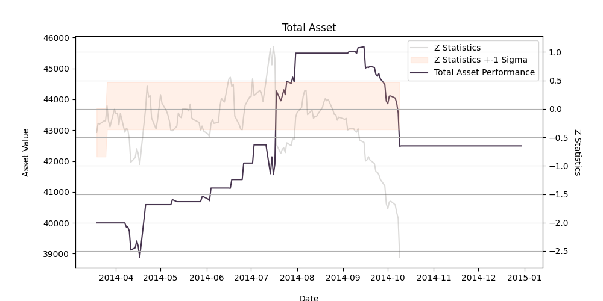

# Pair Trading Strategy Using Cointegration

This project implements a **pair trading strategy** based on cointegration testing. The approach uses the Engle-Granger two-step method to test for cointegration and generates trading signals based on the historical relationship between two financial assets. The strategy aims to profit from mean-reverting behavior by going long on one asset and short on the other when deviations from the mean occur.

## Table of Contents
- [Background](#background)
- [Features](#features)
- [How It Works](#how-it-works)
- [Results](#results)
- [Dependencies](#dependencies)

---

## Background

Pair trading, also known as **mean reversion trading**, involves identifying two cointegrated assets, such as:
- A stock and an ETF index
- Two stocks in the same industry

The relationship between the two assets is akin to a "drunk man and dog" analogy:
- The assets are bound by an invisible "leash" (cointegration).
- If one asset becomes too bullish, the strategy shorts it while going long on the bearish asset, expecting them to converge eventually.

### Risks
- Cointegration can break due to market dynamics (e.g., a new product launch).
- Historical relationships do not guarantee future outcomes.
- Always validate cointegration status before trading execution.

---

## Features

1. **Cointegration Testing**
   - Implements the Engle-Granger two-step method.
   - Tests for the stationarity of residuals and checks for adjustment coefficients.

2. **Signal Generation**
   - Creates trading signals based on the deviation of prices (z-statistics).
   - Sets thresholds for entry and exit based on standard deviations.

3. **Visualization**
   - Plots trading signals for both assets.
   - Visualizes portfolio performance, including z-statistics and asset value changes.

4. **Backtesting**
   - Simulates the strategy using historical data for performance evaluation.

---

## How It Works

### Cointegration Test (Engle-Granger Method)
1. **Step 1: Long-Run Equilibrium**
   - Regress one asset's price on the other's to estimate the equilibrium.
   - Test residuals for stationarity using the Augmented Dickey-Fuller (ADF) test.

2. **Step 2: Error Correction Model**
   - Use residuals from Step 1 to adjust short-term deviations.
   - Ensure adjustment coefficients are negative, indicating convergence.

### Signal Generation
- If cointegration holds, calculate z-statistics for residuals.
- Set thresholds for trading signals:
  - **Upper bound**: Short the bullish asset and long the bearish one.
  - **Lower bound**: Long the bullish asset and short the bearish one.

### Visualization
- Plots:
  - Positions (long/short) for both assets.
  - Portfolio performance over time.
  - Z-statistics with thresholds.

---
## Results
**1. Pair Trading Signals**
The chart below shows the price movements of NVDA and AMD, along with the trading signals generated by the strategy.



### **Key Observations:**
- **Stock Prices of NVDA and AMD:**
  - NVDA (blue line) and AMD (brown line) represent historical price movements.
  - NVDA is on the left y-axis, while AMD is on the right y-axis.
- **Trading Signals:**
  - **Green Triangles:** Represent "LONG" signals (buying positions).
  - **Red Triangles:** Represent "SHORT" signals (selling positions).
- **Key Takeaway:**
  - Signals are generated when the z-statistic breaches the threshold, indicating misalignment in the pair relationship.


**2. Portfolio Performance**
The chart below illustrates the portfolio's total asset value over time, along with the z-statistic and its one-standard-deviation bounds.



### **Key Observations:**
- **Portfolio Performance:**
  - The purple line represents the total asset value of the portfolio.
  - There is a steady increase in value until mid-2014, followed by a sharp decline in late 2014.
- **Z-Statistics:**
  - The z-statistic (grey line) measures the deviation of the pair from its mean.
  - The shaded region represents ±1 standard deviation (1 sigma), indicating the range of typical pair alignment.

### **Key Inferences:**
1. **Effectiveness of Strategy:**
   - Multiple trading opportunities are generated as the z-statistic fluctuates.
   - The strategy performs well during periods of stability but struggles during periods of significant divergence.
2. **Risk Management:**
   - The sharp decline in late 2014 highlights the importance of monitoring cointegration validity and adjusting the strategy when external factors impact the relationship.

---

## Dependencies

The following Python libraries are required:
- `matplotlib`
- `numpy`
- `pandas`
- `yfinance`
- `statsmodels`

Install these dependencies via pip:

```bash
pip install matplotlib numpy pandas yfinance statsmodels
